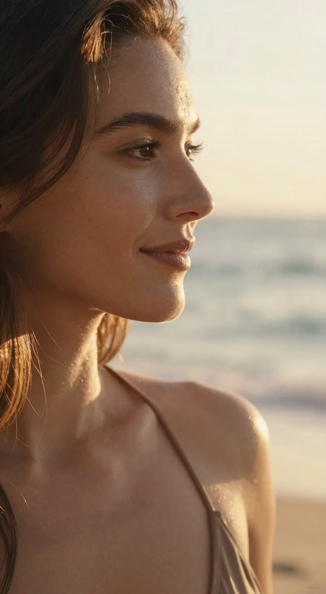

# mlx-video-gen

Type a prompt, get a short video, all on your Mac. An image model draws the first frame, then a video model animates it.

```
prompt ──► Z-Image Turbo ──► image.png ──► Wan 2.2 5B (Turbo LoRA) ──► video.mp4
```

Starting from an image works better than text-to-video alone, which tends to drop the subject.

## Why

Cloud video tools cost money per clip and keep your prompts. ComfyUI runs locally but is a node graph to learn. This is one ~70-line Python file on [MLX](https://github.com/ml-explore/mlx), so it's easy to read, change and run offline on a Mac.

| First frame | Video |
|---|---|
|  | [GreatDemo](examples/GreatDemo/video.mp4): paper boat in a neon puddle |
|  | [ReachDemo](examples/ReachDemo/video.mp4): beach close-up, two shots |

## Setup

Needs an Apple Silicon Mac (32 GB), [uv](https://docs.astral.sh/uv/) and about 25 GB free.

```bash
uv sync
uv run hf download filipstrand/Z-Image-Turbo-mflux-4bit --local-dir models/Z-Image-Turbo-mflux-4bit
uv run hf download Kijai/WanVideo_comfy LoRAs/Wan22-Turbo/Wan22_TI2V_5B_Turbo_lora_rank_64_fp16.safetensors --local-dir models/loras
uv run hf download Wan-AI/Wan2.2-TI2V-5B --local-dir models/Wan2.2-TI2V-5B
uv pip install torch --index-url https://download.pytorch.org/whl/cpu
uv run python -m mlx_video.models.wan_2.convert --checkpoint-dir models/Wan2.2-TI2V-5B --output-dir models/Wan2.2-TI2V-5B-MLX --quantize --bits 4
```

Torch is only needed for that last conversion. After it, `models/Wan2.2-TI2V-5B` can be deleted.

## Run

```bash
uv run python generate.py "A tiny white paper boat floating in a puddle on wet asphalt at night"
uv run python generate.py "..." --motion "The boat drifts toward the camera." --seconds 3 --seed 7
uv run python generate.py "..." --image-only
```

Writes `outputs/<time>.png` and `outputs/<time>.mp4`. The seed is printed so you can repeat a result.

A 1.7 s clip (the default) takes a few minutes; 5 s takes about 18. `--image-only` is the fast way to test a prompt.

## Prompt tips

- Name the subject and its size first, then the setting.
- `--motion` describes only what moves. Don't repeat what the image already shows.
- Leave out words, prices and logos. The models can't draw text.
- Faces in full-body shots drift; close-ups hold better.

## Examples

`examples/` holds four finished videos with the prompt or storyboard and the image they started from. ReachDemo, StockDemo and ExplainDemo also used voiceover, captions and drawn graphics from the storyboard pipeline, which lives on the [`storyboards` branch](https://github.com/garvitkhurana/mlx-video-gen/tree/storyboards).

## What's been tested

- Run end to end on one machine: MacBook Pro M5, 32 GB, macOS 26. A 1.7 s clip (41 frames, 704×1280) took 8.5 minutes, 4 of them in the final VAE decode.
- Not tested: other Macs, less than 32 GB of memory, clips longer than 5 s, or a fresh setup from scratch with the commands above (they're the ones used, but not rerun in a clean checkout).
- There are no automated tests.

## Licenses

Wan 2.2 and Z-Image Turbo weights: Apache 2.0. `mlx-video`, `mflux`: MIT. The Turbo LoRA has no stated license; clear it before any paid use.
